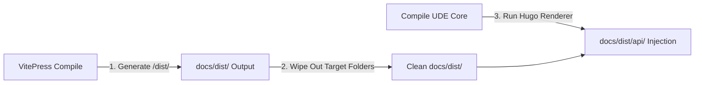

# Case Study: Building This Portal

The very developer portal you are viewing right now is built on a transparent, self-documenting "dogfooding" architecture. This page details how UDE compiles its own Python source files to generate live API references nested inside these VitePress Guides.

---

## 🐕 The Dogfooding Concept

To prove that the Universal Document Engine can withstand high-load enterprise pipelines, we use UDE to document UDE. The Python core engine's modules (such as `ude.cli` and `ude.orchestrator`) are processed by our own compiler, generating the `/api/` pages in this system.

This approach ensures:
*   **Constant Real-World Verification**: Any parsing or rendering bugs in new commits are caught instantly during our own documentation build.
*   **Live Demos**: Users can explore the live <a href="/ude-user-docs/api/" rel="external" target="_self">API Reference</a> to see the exact visual output styles produced by the system.

---

## 📂 Local Workspace Directory Junctions

To allow developers to test self-compilation locally without messing up Git submodules or triggering circular reference loops, we configure **Windows Directory Junctions**:

```text
Pipeline/ (Parent Repository)
├── engine/ (Core Codebase)
└── user-docs/ (This Submodule)
    └── engine ── [Directory Junction Link] ──> ../engine/
```

By linking `user-docs/engine` directly to the parent codebase folder, local compilers can inspect python docstrings dynamically without duplicating files or writing absolute, non-portable directory paths.

---

## 📑 Self-Configuration Block Walkthrough

The self-documenting pipeline is controlled by `user-docs/ude_config_self.json`. Let's inspect its key parameters:

### 1. Source Collectors & XML Destinations
```json
"collector": {
  "xml_dir": "./engine/build/xml/",
  "doxygen_flags": ["-q"]
}
```
*Directs UDE to invoke Doxygen over the local `engine/` source files linked via our directory junction, outputting raw XML AST files safely into the local build folder.*

### 2. Selecting the Hugo Markdown Renderer
```json
"renderer": {
  "output_dir": "./.vitepress/dist/api/",
  "format": "hugo-markdown"
}
```
*Tells the engine to output in standard `hugo-markdown` format, generating a cross-linked API Reference catalog directly into VitePress's compilation directory.*

### 3. Defining Submodule Target Roots
The configuration specifies target submodules, ensuring that compiled catalogs match the structural namespaces of our production engines.

---

## ⚙️ Build Order Orchestration (The Patch)

To prevent VitePress from wiping out our generated API catalog during production builds, our CI/CD pipeline enforces a strict **Build Order Patch**:



1.  **VitePress Compile**: The command `npm run docs:build` compiles the human guides, outputting the SPA site to `.vitepress/dist/`.
2.  **Wipe Out**: VitePress always wipes out its target folder before writing.
3.  **UDE Compile & Hugo Run**: Only *after* VitePress finishes, the Python orchestrator compiles UDE's source docstrings and invokes Hugo to render the technical reference layer directly into `.vitepress/dist/api/`.

This build order ensures zero routing errors (404s) and delivers a seamless, unified developer portal experience containing both conceptual guides and technical references under a single hostname.
