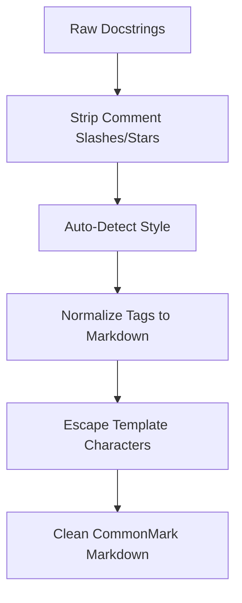

# Commenting Rules & Docstring Standards

To produce pristine, high-aesthetic code references, UDE relies on structured comments and docstrings within your codebase. This guide details the supported commenting styles and how UDE's normalization flow converts them into clean, standardized CommonMark markdown.

---

## 📑 Supported Commenting Styles

The UDE Normalization Engine natively detects and parses three industry-standard documentation formats:

### 1. Javadoc Style (`@param` / `@return`)
Widely used in C++ and Java environments. This style relies on `@` tags:
```cpp
/**
 * @brief Computes the bounding box of a 3D mesh.
 * @param mesh The input mesh model.
 * @param tolerance Precision tolerance factor.
 * @return True if successful, false otherwise.
 */
bool ComputeBounds(const Mesh& mesh, double tolerance);
```

### 2. Doxygen Style (`\param` / `\return`)
The default format for C# and C++ cross-compilation:
```cpp
/**
 * \brief Computes the bounding box of a 3D mesh.
 * \param mesh The input mesh model.
 * \param tolerance Precision tolerance factor.
 * \return True if successful, false otherwise.
 */
bool ComputeBounds(const Mesh& mesh, double tolerance);
```

### 3. Google Python Style (`Args:` / `Returns:`)
The preferred layout for clean, indentation-based docstrings:
```python
def compute_bounds(mesh, tolerance):
    """Computes the bounding box of a 3D mesh.

    Args:
        mesh (Mesh): The input mesh model.
        tolerance (float): Precision tolerance factor.

    Returns:
        bool: True if successful, false otherwise.
    """
```

> [!NOTE]
> **Functional Traceability**:
> The automatic format detection and parsing pipeline traces directly to **[REQ-FUN-20: Docstring Normalization Engine](https://Sir-Derryk.github.io/ude-design-docs/docs/srs/functional#req-fun-20)**.

---

## 🛠️ Parameter Mapping & Types

During the parsing phase, UDE parses the parameter descriptions and mappings. It separates raw textual information from structured types, allowing renderers to output cohesive table formats:

| Parameter | Type | Description |
| :--- | :--- | :--- |
| `mesh` | `Mesh` / `const Mesh&` | The input mesh model to analyze. |
| `tolerance` | `double` / `float` | Precision tolerance for calculation. |

The engine also preserves default values (e.g., `= 1e-6`) and optional parameters, mapping them transparently into the intermediate representation.

---

## 🔄 The CommonMark Normalization Flow

Raw comments undergo a rigid multi-stage normalization pipeline to ensure they are rendered correctly across different layouts:



1. **Stripping**: Removing leading `///`, `/**`, `*`, or `#` comment boundaries.
2. **Style Detection**: Determining Javadoc, Doxygen, or Google Python style by analyzing keywords (e.g. `@param`, `\param`, or `Args:`).
3. **CommonMark Conversion**: Translating tag properties into Markdown tables, bulleted lists, and standard sections.
4. **HTML/Template Protection**: Escaping C++ templates (like `std::vector<T>`) to prevent renderers from treating them as HTML tags.

---

## 🏁 Formatting Examples

Here is a side-by-side comparison of a raw docstring input versus its compiled HTML representation in the developer portal:

#### Raw Input (C++ Header):
```cpp
/**
 * \brief Normalizes a 3D vector.
 * \note Ensure the vector magnitude is non-zero.
 * \param vec Vector to modify.
 */
void Normalize(Vector3D& vec);
```

#### Compiled Output:
::: info
**Normalizes a 3D vector.**

> **Note**: Ensure the vector magnitude is non-zero.

**Parameters:**
* **`vec`** (`Vector3D&`): Vector to modify.
:::
