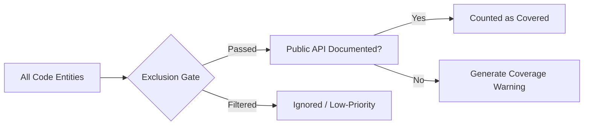

# Exclusion Gates & Ignore Filters

In large enterprise codebases, documentation portals can easily become cluttered with private boilerplates, internal helpers, and machine-generated SWIG wrapper files. UDE provides flexible exclusion gates to keep your public developer API documentation clean, pristine, and secure.

---

## 🚪 Why Filter Documentation?

Not all code is meant to be exposed. Internal helper classes, package-private utilities, and low-level memory allocators distract external developers and increase the cognitive load. By filtering out non-public APIs, you:
*   Ensure users focus only on public, supported APIs.
*   Keep compiled index sizes small for fast search and load times.
*   Prevent leaks of proprietary or internal system architectures.

---

## 🛠️ Exclusion Techniques

UDE supports three powerful methods to filter out unwanted code elements directly from source comment annotations:

### 1. Block Ignorance (`DOM-IGNORE-BEGIN` / `DOM-IGNORE-END`)
Allows developers to completely omit specific regions of code files from the compiler's view:
```cpp
// DOM-IGNORE-BEGIN
class PrivateHelperEngine {
    void InternalSetup();
};
// DOM-IGNORE-END
```

### 2. Conditional Blocks (`@cond` / `@endcond`)
Compatible with standard Doxygen conditional tags:
```cpp
/// @cond
void SecretCallbackAPI();
/// @endcond
```

### 3. Member & Class Tagging (`@internal` / `\internal`)
Marks an entire class, method, or field as internal. UDE automatically filters these during parsing:
```cpp
/**
 * \internal
 * This class handles memory buffer layouts and should not be public.
 */
class BufferLayoutManager { ... };
```

> [!NOTE]
> **Functional Traceability**:
> Direct support for inline annotation filtering traces to **[REQ-FUN-30: Exclusion Filters](https://Sir-Derryk.github.io/ude-design-docs/docs/srs/functional#req-fun-30)**.

---

## 🤖 Automated Omissions (Swig Helper Filtering)

When wrapping C++ libraries for Java, C#, or Python using SWIG, compilers automatically generate a huge volume of boilerplates. Methods like `swigCPtr`, `Dispose()`, and pointer-backed constructors clutter your class references.

UDE automatically identifies SWIG patterns and prunes them from the `ProjectCatalog` entirely. For example, any method containing `swig` in its name or matching standard memory dispose patterns is filtered unless explicitly allowed in `ude_config.json`.

---

## 📊 Validation of Ignored Metrics

Excluding entities does not just remove them from output pages; it also changes the documentation health metrics reported by your build pipeline:



*   **Public API Coverage**: Low-priority helper methods and internal structures do not penalize your overall documentation quality score.
*   **Quality Gate Rules**: Ensures CI/CD builds only generate alerts or fail if crucial, public-facing interfaces are missing documentation, satisfying **[REQ-BUS-08: Documentation Coverage & Quality Gate Separation](https://Sir-Derryk.github.io/ude-design-docs/docs/brd/requirements#req-bus-08)**.
