# Getting Started with UDE

Welcome to the **Universal Document Engine (UDE)**! This guide will take you from zero to compiling your first codebase reference in under 60 seconds.

---

## 📐 Core Pipeline Concept

UDE works on a decoupled three-stage pipeline architecture to ensure absolute flexibility, speed, and standard compliance:

```mermaid
graph LR
    SC[Source Code] -->|Step 1| Coll[Doxygen Collector]
    Coll -->|Step 2| XML[Raw XML AST]
    XML -->|Step 3| Parser[UDE XML Parser]
    Parser -->|Step 4| IR[Agile Compressed IR]
    IR -->|Step 5| Renderer[UDE Renderer]
    Renderer -->|Step 6| Output[Static Markdown / HTML / RAG JSON]
    
    style Coll fill:#fff0eb,stroke:#ff3100,stroke-width:2px,color:#0f172a
    style Parser fill:#fff0eb,stroke:#ff3100,stroke-width:2px,color:#0f172a
    style Renderer fill:#fff0eb,stroke:#ff3100,stroke-width:2px,color:#0f172a
    style IR fill:#f0f9ff,stroke:#0284c7,stroke-width:2px,color:#0f172a
```



---

## 💻 Environment Prerequisites

Before running UDE, please ensure that your host machine has the following tools installed and available in the system PATH:

### 🐍 Python Runtime (3.11+)
Verify your local Python installation by running:
```bash
python --version
```
*Must be version 3.11 or greater.*

### 📑 Doxygen Parser
Doxygen acts as our structural extractor. Verify that Doxygen is available on your PATH:
```bash
doxygen --version
```
*If not installed, please download it from the official [Doxygen website](https://www.doxygen.nl/) or install via your system package manager (e.g., `sudo apt-get install doxygen` or `brew install doxygen`).*

### 📦 Package Managers
Ensure either `pip` or `poetry` is installed and ready to resolve package dependencies.

> [!NOTE]
> **Traceability Trace**:
> This preflight check complies with the strict verification gate defined in Functional Specification **[REQ-FUN-01: Preflight Environment Validation](https://Sir-Derryk.github.io/ude-design-docs/docs/srs/functional#req-fun-01)**.

---

## 🚀 Quick Installation

You can set up UDE in your workspace using standard Python packages:

### Method 1: standard setup via pip
Run the following command in your terminal:
```bash
pip install universal-document-engine
```

### Method 2: Local development setup via Poetry
To run and edit UDE source code directly:
```bash
git clone https://github.com/Sir-Derryk/universal-document-engine.git
cd universal-document-engine
poetry install
```

---

## ⚡ Your First Compilation (Hello World)

To quickly verify that your setup and Doxygen compiler are working properly, run the following command over our included mock assets:

```bash
python -m ude.cli --input ./tests/assets/xml/ --output ./output-docs/ --format html
```

### Expected Output
If successful, the console will output:
```text
[INFO] UDE: Validating system environment...
[INFO] UDE: Found Doxygen executable in PATH.
[INFO] UDE: Starting compilation of 22 codebase classes...
[INFO] UDE: Writing compressed intermediate representation (IR) to build cache...
[INFO] UDE: HTML compilation complete in 0.42 seconds.
```

> [!TIP]
> **Massive Speed Gates**:
> Thanks to our compressed two-level caching engine, incremental compilations over massive codebases (up to 1,000 entities) are completed in under 5 seconds, satisfying **[REQ-BUS-02: Strict Execution Speed Gates](https://Sir-Derryk.github.io/ude-design-docs/docs/brd/requirements#req-bus-02)**.
