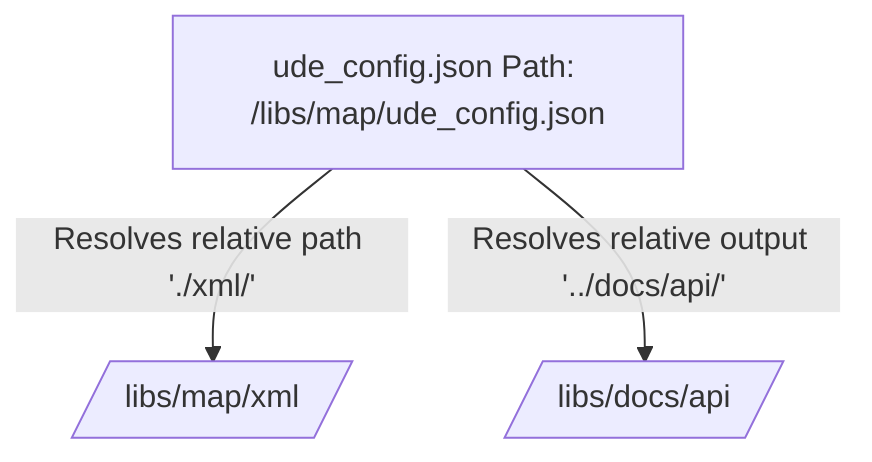

# Target Pipeline Configurations

UDE employs a decentralized configuration design where each software product owns its pipeline parameters via an individual `ude_config.json` file. This architecture avoids massive monolithic configurations and lets teams manage their documentation pipelines alongside their codebase.

---

## 📐 Decentralized Configuration Strategy

Instead of maintaining a giant system-wide map of all source repositories, each submodule or code module includes its own target configuration file. This provides several operational benefits:
*   **Isolated Customization**: Teams can adjust preprocessor flags or filter SWIG helpers without affecting other products.
*   **Local Developer Testing**: Developers can compile references locally over their workspace using the exact same pipeline parameters as the production CI/CD environment.
*   **Version Control Integration**: Configuration files live in the same Git branch as the source code, preventing configuration drift when API schemas change.

---

## 📑 Target Config Schema Specifications

A target config `ude_config.json` consists of four main specification objects:

### 1. Codebase Metadata (`product`)
Defines the identification parameters of the product being compiled:
*   `name`: The display name used in documentation headers.
*   `version`: The version string of the codebase (e.g. `v1.2.4`).

### 2. Collector Specifications (`collector`)
Sets parameters for the preprocessor stage:
*   `xml_dir`: Folder where Doxygen outputs raw XML documents.
*   `doxygen_flags`: Inline parameters passed to Doxygen during execution.

### 3. Parser Specifications (`parser`)
Controls how raw structures are mapped to the intermediate representation (IR):
*   `exclude_namespaces`: Namespaces to skip during AST extraction.
*   `filter_wrappers`: Automatically prunes language helper classes (e.g. SWIG).

### 4. Renderer Specifications (`renderer`)
Controls the final generation phase:
*   `output_dir`: The destination folder where static guides and catalogs are generated.
*   `format`: The output target format (`hugo-markdown`, `standalone-html`, or `rag-json`).
*   `templates_dir`: Folder containing custom Jinja2 HTML/Markdown layout files.

---

## 🔄 Relative Path Resolution Rules

To support seamless local developer runs and standardized CI/CD pipelines, UDE resolves all paths relative to the configuration file's physical directory on disk:



This absolute portability ensures that the orchestrator executes identically whether invoked from the project root, the submodule directory, or any arbitrary workspace folder.

:::note
**Functional Traceability**:
This folder resolution standard complies with Functional Specification **[REQ-FUN-12: Configuration Portability Resolution](https://Sir-Derryk.github.io/ude-design-docs/docs/srs/functional#req-fun-12)**.
:::

---

## 📑 Complete Target Template (Example)

Here is a real-world, complete target configuration file for the C++ Map product:

```json
{
  "product": {
    "name": "Map Module C++",
    "version": "2.1.0"
  },
  "collector": {
    "xml_dir": "./build/doxygen/xml/",
    "doxygen_flags": ["-q"]
  },
  "parser": {
    "exclude_namespaces": [
      "std",
      "__impl"
    ],
    "filter_wrappers": true
  },
  "renderer": {
    "output_dir": "../../user-docs/docs/api/map/",
    "format": "hugo-markdown",
    "templates_dir": "./templates/"
  }
}
```
